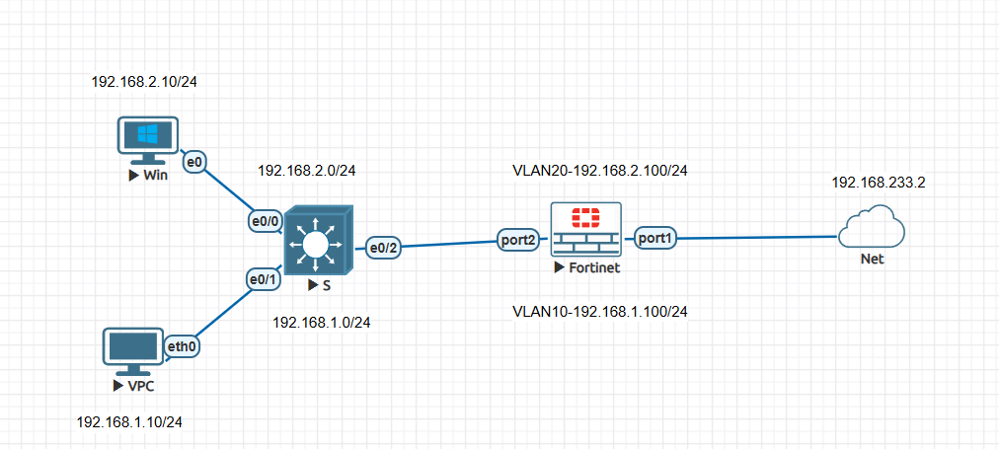

# fortigate-vlan-lab
FortiGate VLAN routing + user-group Internet access (EVE-NG)
# FortiGate VLAN Lab with User-Group Internet Access

> **Hands-on lab using FortiGate-VM (evaluation) in EVE-NG**  
> VLAN 10 (IT) and VLAN 20 (HR) with firewall policies and NAT

---

## Topology


---

## Objectives
- Configure VLAN subinterfaces on FortiGate
- Assign IP addresses to VLANs
- Create firewall policies per user group
- Enable NAT for Internet access
- Troubleshoot with `diagnose debug flow`

---

## Lab Components
| Device | IP | VLAN |
|-------|----|------|
| FortiGate | `port2.10`: 192.168.10.1/24 | VLAN 10 (IT) |
| FortiGate | `port2.20`: 192.168.20.1/24 | VLAN 20 (HR) |
| PC-IT | 192.168.10.10 | VLAN 10 |
| PC-HR | 192.168.20.10 | VLAN 20 |

---

## Key Configurations

### VLAN Subinterfaces
```bash
config system interface
    edit "port2.10"
        set vlanid 10
        set interface "port2"
        set ip 192.168.10.1 255.255.255.0
    next
    edit "port2.20"
        set vlanid 20
        set interface "port2"
        set ip 192.168.20.1 255.255.255.0
    next
end
